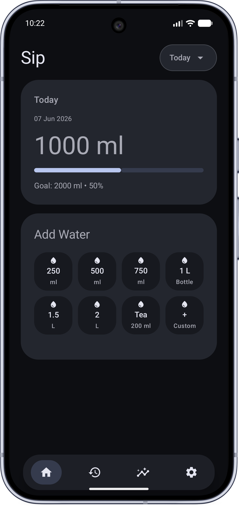
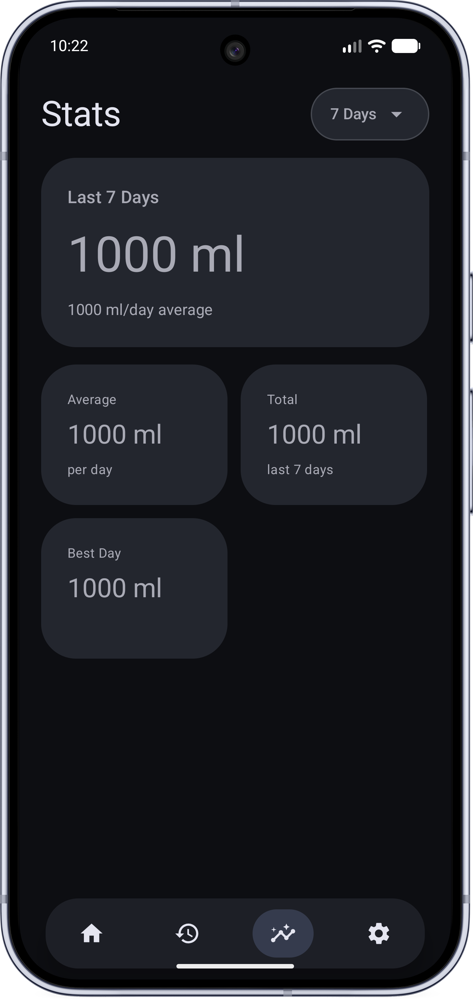
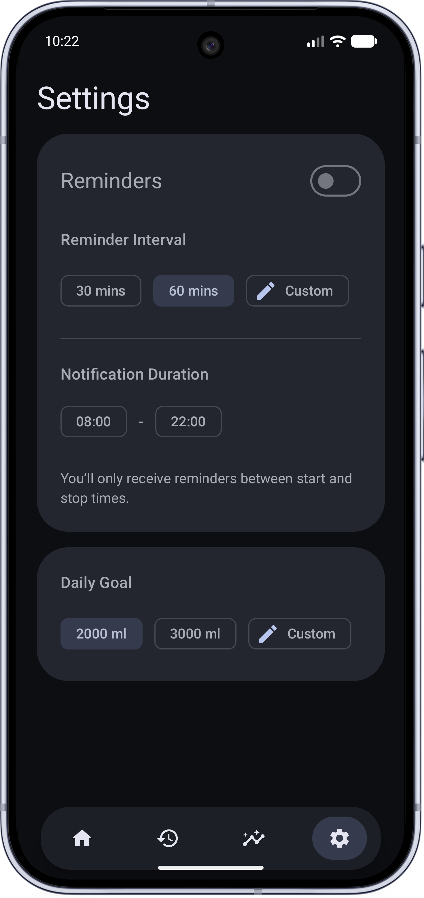

# Sip

Sip is a simple hydration tracker built with Kotlin and Jetpack Compose.
Track daily water intake, view history, and receive hydration reminders throughout the day.

  
  &nbsp;&nbsp;
   
  &nbsp;&nbsp;
 

## Features

- Quick water logging
- Custom water amounts
- Daily hydration goal
- Reminder notifications
- Start and end reminder times
- History
- Material 3 UI

## Built With

- Kotlin
- Jetpack Compose
- Room Database
- DataStore
- AlarmManager
- Material 3

## Permissions

Sip may request:

- Notification permission
- Exact alarm permission
- Battery optimization exemption
  These are used for reliable reminder notifications.
